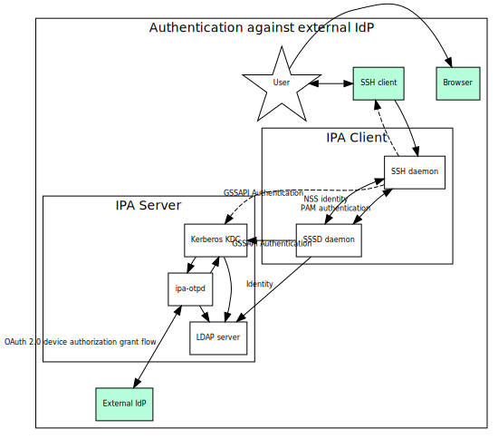

# FreeIPA and an external identity provider integration

[TOC]

FreeIPA provides an integrated identity management solution for POSIX-like environments. Its implementation has been based on a number of assumptions about a usage and a representation of users and groups in a generalized POSIX environment. Such users and groups consumed by the applications running in POSIX environment in several common ways:

 - application processes run under user identity;
 - application processes create or access files attributed to specific users and groups;
 - a set of groups a user belongs to is fixed at a login time and does not change until that login session is completed;
 - an authentication flow of a user is directly tied with a login session that happens as a result of authentication.

These identity consumption patterns equate presence of POSIX user and group IDs with ability to run application processes under these identities. In many deployments, however, there is a considerable shift towards compartmentalization where application-level identities are not necessarily the same the system level ones.

Usage shift does not, however, dictate an exclusion between the two models. The same users need to access both operating system-level applications and be able to authenticate as application-level identities. This is typically achieved by forming a single sign-on environment where a user would be authenticated directly once and then the fact of authentication is consumed by other services for a certain amount of time, regardless of how the applications that represent these services are operating.

In this document discussion of 'application-level identities' really means resource owner identities visible through OAuth 2.0 Authorization Framework. This level of abstraction allows discussing of authentication and access to resources regardless of internal details of a specific application.

There are two major use cases covered by this document:
- FreeIPA is used as a backend to provide identities that some identity provider (IdP) to authenticate via OpenID Connect. This IdP would be called 'an integrated IdP' to FreeIPA.
- FreeIPA uses an integrated IdP to perform identity verification and ask for an access grant to itself of identities that were authenticated against some external IdP which exists in a federated relationship with an integrated IdP used by FreeIPA.

Since there is a number of IdP implementations, for the scope of this document we are focusing on how to integrate FreeIPA with [Keycloak](https://www.keycloak.org) project.

## FreeIPA as a backend of an integrated identity provider

Keycloak already supports integration with FreeIPA as a backend to lookup and authenticate identities. This can be achieved by using User Storage Federation. Two existing User Storage Providers that allow connecting to FreeIPA are:
- LDAP/Active Directory provider,
- SSSD provider.

LDAP/Active Directory provider is limited in its abilities to authenticate users in FreeIPA. In particular, it is not possible to implement password-based authentication for users in FreeIPA with RADIUS proxy configuration because such proxying is only available through the Kerberos authentication flow. The Kerberos authentication provider in Keycloak is implemented using org.ietf.jgss and javax.security.auth.kerberos frameworks. The latter does not have any support for pre-authentication mechanisms which are required to implement two-factor authentication through Kerberos and also have no support for newer and secure pre-authentication mechanisms like SPAKE. While it is possible to enable use of a native (operating system-provided) GSS-API implementation, such as MIT Kerberos, a support for client-side authentication with OTP pre-authentication mechanism requires additional work on the client (Keycloak plugin) side and a knowledge about the fact that this user identity must have additional processing. This information must be obtained out of band before initiating the authentication request by the User Storage Federation provider. Neither of the existing providers sources and exposes this information (it is also not easily discoverable).

On the other side, SSSD provider is read-only. It is not possible to provision new users in FreeIPA through it. Implementation of SSSD provider requires use of D-BUS and UNIX domain sockets which is relatively unusual for Java ecosystem of Keycloak. As a result, there is a number of external dependencies that must be maintained beyond actual SSSD provider code. On the other hand, SSSD provider authenticates against FreeIPA through the use of Kerberos protocol and supports all types of authentication supported in FreeIPA.

Since SSSD provider does not give ability to provision new users into FreeIPA, it is desirable to conceive a new User Storage provider for Keycloak that would combine both writable and read interfaces.

A common approach to connect different identity management solutions is to make a generic bridge between them. One of the latest iterations in this area is [SCIM v2 API](http://www.simplecloud.info/). SCIM specification provides a REST API which SCIM client could call to manipulate resources on a SCIM server. In Keycloak ecosystem there is already [a work under way](https://github.com/Captain-P-Goldfish/scim-for-keycloak) to enable Keycloak to be SCIM v2 client.

FreeIPA does not implement SCIM v2 REST API. Its own API does not follow REST principles. Thus, an interface between the two is required. However, using IPA API to retrieve user information is not practical as performance of IPA API is not great for high read rates and only IPA users would be visible in these calls.

This project focuses on the implementation of SCIM v2 server for FreeIPA by relying on existing SCIM v2 open source projects. We can choose [django-scim2](https://github.com/15five/django-scim2) which is written in Python, similar to FreeIPA, and can be integrated with existing FreeIPA Python API.

### General requirements

While an implementation of the SCIM v2 server for FreeIPA would be useful in itself, primary goal is to simplify integration of Keycloak with an enterprise infrastructure that FreeIPA, Active Directory or standalone LDAP and Kerberos solutions provide. Thus, a server developed as a part of this solution would be a generalization over a combination of existing tools already provided as part of FreeIPA infrastructure but useful independently.

For the purpose of this document, we would call the generalized server a '*Backend Server*'.

Since the Backend Server would handle all tasks to replace corresponding User Federation plugins in Keycloak, new User Federation plugin would need to be created to be able to utilize the server.

For the purpose of this section, *integration domain* term means an identity and authentication realm that encapsulates:
- user identities
- group identities, members of the groups are user identities
- a method to retrieve identity details, as supported by SSSD
- a method to perform authentication of the user identity on behalf of an IdP, as supported by SSSD
- a method to modify identity details

Following general requirements exist to the Backend Server:

1. SCIM v2 API end-point is provided to allow:
1.1. Look up of users and groups using SCIM v2 REST API requests for the specific integration domain
1.2. Authentication requests for the users known through SCIM v2 REST API for the specific integration domain
1.3. Management of users and groups through SCIM v2 REST API for the specific integration domain:
1.3.1. Add user or group
1.3.2. Modify attributes of a user or group
1.3.3. Remove user or group
1.3.4. Associate authentication information with a user
1.3.5. [Optional] Rename user or group
2. Administrative end-point is provided to allow:
2.1. Add new integration domain configuration
2.2. Remove an integration domain configuration
2.3. Change an integration domain configuration.

Following general requirements exist to the Keycloak User Federation plugin:

3. Plugin configuration should allow:
3.1. Configuration of the Backend Server:
3.1.1. Add new integration domain configuration
3.1.2. Remove an integration domain configuration
3.1.3. Change an integration domain configuration
3.2. Integration with Keycloak components:
3.2.1. `UserLookupProvider`
3.2.2. `UserQueryProvider`
3.2.3. `UserRegistrationProvider`
3.2.4. `CredentialInputUpdater`, `CredentialInputValidator`
3.2.5. [Optional] Support for a bulk import and validation of user and group information.

Since Keycloak deployments will be done in a containerized environment, the Backend Server is preferred to be provisioned in a containerized environment as well. Following general requirements exist to the provisioning of the Backend Server:

4. Backend Server provisioning should support:
4.1. Default configuration of the Backend Server with no integration domains and predefined administrative end-point credentials
4.2. Operation in OpenShift environment under a single runtime user UID
4.3. Provisioning of required TLS material to protect the Backend Server HTTP end-points
4.4. Configuration of a firewall to allow communication of the Backend Server with domain controllers from integration domains.

### Individual tasks

Tasks below are focused on the content for the proof of concept phase. In particular, they specifically avoid automated management of the integration domains until the basic Backend Server implementation is done.

#### Base SCIM v2 server

Using Django and django-scim2, create a default API end-point to look up users and groups from a Django-provided database.

The basic implementation can be limited to support a plain password authentication method for SCIM v2 API end-point.

#### Data model for a read-only integration domain

Define a data model for an integration domain. The domain would need to provide an API to perform a data query in a particular application SSSD domain, introspect domain settings, all read-only.

#### Add API and end-point for authenticating users from an integration domain

Add an API and a separate end-point to authenticate users from a particular integration domain. Initial implementation needs to support username / password variant but eventually all methods supported by the integration domain would need to be added and accounted for.

#### Initial implementation of integration domain for IPA provider

Implement integration domain for IPA provider using existing SSSD domain definition. At this point SSSD can be enrolled into IPA deployment with the help of external tools (e.g. no management of integration domain configuration in the Backend Server yet).

#### Initial implementation of integration domain for AD provider

Implement integration domain for AD provider using existing SSSD domain definition. At this point SSSD can be enrolled into or associated with AD deployment with the help of external tools (e.g. no management of integration domain configuration in the Backend Server yet).

#### Initial implementation of integration domain for LDAP provider

Implement integration domain for LDAP provider using existing SSSD domain definition. At this point SSSD can be associated with LDAP deployment with the help of external tools (e.g. no management of integration domain configuration in the Backend Server yet).


#### Data model for a writable integration domain

Define a data model and API to be able to write user and group changes to an integration domain's source.

Implement a writable support in the integrated Django database for test purposes.

#### Extend integration domain for IPA provider with writable interface

Use IPA API to extend IPA integration domain to write back user and group modifications for attributes visible through IPA API.

#### Extend integration domain for LDAP provider with writable interface

Use LDAP abstraction API developed in FreeIPA project to extend LDAP integration domain to write back user and group modifications for attributes defined in the LDAP integration domain configuration

#### Extend integration domain for AD provider with writable interface

Use LDAP abstraction API developed in FreeIPA project to extend AD integration domain to write back user and group modifications for attributes defined in the AD integration domain configuration

#### Add GSSAPI authentication for users from an integration domain

For those integration domains that support GSSAPI authentication, handle it in the end-point for the authentication. This would require cooperation with an external client in case of a proxy-forwarding. A Keycloak plugin implementation would then use proxy-forwarding of the requests sent to Keycloak end-point by the original clients while the Backend Server implementation would do actual GSSAPI authentication.

#### Implement base Keycloak plugin to talk to the Backend Server

Proof of concept implementation of the Keycloak plugin would need to cover:

 - basic configuration to set up access to the Backend Server
 - choice of the integration domain to use
 - support for the following APIs from Keycloak side:
3.2.1. `UserLookupProvider`
3.2.2. `UserQueryProvider`
3.2.3. `UserRegistrationProvider`
3.2.4. `CredentialInputUpdater`, `CredentialInputValidator`

-------------------------

### Keycloak plugin design

SCIM Keycloak user storage plugin can be added as a User Federation provider in the keycloak admin console. The plugin requires an admin-provided Backend URL (server.example.com:8080), plugin operations will use this URL for CRUD operations against SCIM endpoints.

#### User lookup and import strategy

The SCIM Keycloak plugin utilizes the import implementation strategy. When a user logs in to keycloak, that user will be imported into the local keycloak database. This allows subsequent lookups to use the keycloak local database as a cache, reducing load on the Backend server. Existing in-tree keycloak SSSD and LDAP federation plugins use this approach. To implement this strategy correctly, we must consider how to keep the users in sync between keycloak local storage and in SCIM.
 - If a linked local keycloak user is modified: Changes will be propagated to SCIM with PUT update user calls. This is handled in keycloak by proxying the local user using the ImportedUserValidation interface.
 - If a SCIM user is modified: Similar to the LDAP federation provider, Implement ImportSynchronization Interface to allow admin to manually force a sync, or schedule automatic synchronizations.

#### User authentication

Work in Progress

#### User Management

##### Search

Searching for Backend users in the management console will be possible initially with an exact 'username' search, relying on the SCIM server Filtering "eq" equal operator to find a match. If a successful search finds a backend user, keycloak will import that found user into the local keycloak database. The 'View all Users' button will show only locally imported users, currently we do not support mass import functionality.  Support may be added later for:
 - Substring match support, requires backend server support for SCIM filtering "co" contains operator
 - Search by email, firstname, lastname

##### Add/Remove Users

Adding users and deleting SCIM users will be supported from the Users management console. SCIM Implementations may perform a soft-delete by disabling the user instead of removing them. Per RFC 7644: 'Service providers MAY choose not to permanently delete the resource'.

##### Modify user attributes

Modify operations of a user's email, firstname, or lastname attributes are supported delegating to the SCIMUserModelDelegate class. 'username' modification (Rename user) is not yet supported.

#### Groups

When a federated SCIM user logs in, this user's groups are added into keycloak and the group memberships are associated to this user. Unlike with users, Searching groups in the management console only works on local keycloak groups - keycloak does not provide interfaces to add, remove, or modify groups in federated SCIM.

-------------------------

## Use of an integrated IdP to verify external identities for FreeIPA

In order to authenticate a user with an OAuth authentication flow to FreeIPA-enrolled clients, a particular client has to be registered as an OAuth client against an IdP that user utilizes. This is impractical for FreeIPA deployments. What happens in many OAuth2 environments is that instead of registering every single system to the user's IdP, a single client identity is registered. Once a user did log in into an application representing the identity, an application environment specific access token is issued and used by an application backend to access any other resources in the own domain. In a sense this is similar to Kerberos protocol authentication process to obtain a ticket granting ticket (TGT) and later request individual service tickets based on a TGT.

To reduce authentication complexity we can view a whole FreeIPA deployment as a single OAuth client registered with an integrated IdP. The integrated IdP would then handle authentication of the user. If that process would require, in turn, access to a federated identity provider would not need to be known to FreeIPA OAuth client.

Use of a single OAuth client identity still presents an issue with multiple FreeIPA-enrolled clients because they cannot easily share the client identity. Instead, in this design we consider IPA replicas to share OAuth client in a way similar to how they share Kerberos realm master keys: each IPA replica would be able to operate on its own using the same OAuth client identity which is stored in a replicated IPA LDAP tree.

### High-level authentication overview

External IdP integration with FreeIPA is designed with the following assumptions. Identities for users authenticated through the external IdPs stored in FreeIPA as user accounts. They have no passwords associated and instead are forced to authenticate to external IdPs over Kerberos-based authentication flow. The user accounts for externally-authenticated users to be created in advance; this can be achieved manually or automatically with the help of the SCIM v2 bridge.

With the following preconditions
 - FreeIPA deployment is connected to an integrated IdP (Keycloak) with the help of the SCIM v2 bridge
 - Integrated IdP (Keycloak) is registered with the external IdP, to allow external IdP's identities to access the integrated IdP resources,

a general authentication workflow for a user registered in External IdP would be split into two separate steps:
 1. An initial login to Integrated IdP to create an identity
   - a user does not yet exist in the SCIM v2 bridge user storage federation provider:
     - user account in FreeIPA is created automatically, user account's name is derived from the external IdP-provided information
     - user account information is displayed (and self-managed attributes may be modified, if needed)
   - a user does exist in SCIM v2 bridge:
     - user account information is displayed (and self-managed attributes may be modified, if needed)
 2. An interactive login to systems enrolled into FreeIPA deployment
   - the user performs prompt-based authentication to the IPA-enrolled system
   - upon login, a prompt is shown that guides the user to use a separate device to login to a specified URI
   - once logged into a specified URI, the user would be asked to confirm the login intent and be told to use a response code back at the original prompt
   - A response code is entered to the original prompt
   - A backend process behind the login would perform the validation of the response code
   - Once the response is validated, a Kerberos ticket is issued for this login attempt
   - if authentication is successful, an authorization process is performed using standard IPA facilities (HBAC rules, group membership, etc)
   - if both authentication and authorization are successful, user is logged into the system

Upon successful login, the user with External IdP identity would have an initial Kerberos ticket granting ticket in the login session credentials cache. This ticket is further can be used to perform required authentication to other IPA-provided services during its validity time.

### OAuth 2.0 Device Authorization Grant

OAuth 2.0 Device Authorization Grant is defined in [RFC 8628](https://www.rfc-editor.org/rfc/rfc8628) and allows devices that either lack a browser or input constrained to obtain user authorization to access protected resources. Instead of performing the authorization flow right at the device where OAuth authorization grant is requested, a user would perform it at a separate device that has required rich browsing or input capabilities.

Following figure from RFC 8628 demonstrates a generic device authorization flow:

```
      +----------+                                +----------------+
      |          |>---(A)-- Client Identifier --->|                |
      |          |                                |                |
      |          |<---(B)-- Device Code,      ---<|                |
      |          |          User Code,            |                |
      |  Device  |          & Verification URI    |                |
      |  Client  |                                |                |
      |          |  [polling]                     |                |
      |          |>---(E)-- Device Code       --->|                |
      |          |          & Client Identifier   |                |
      |          |                                |  Authorization |
      |          |<---(F)-- Access Token      ---<|     Server     |
      +----------+   (& Optional Refresh Token)   |                |
            v                                     |                |
            :                                     |                |
           (C) User Code & Verification URI       |                |
            :                                     |                |
            v                                     |                |
      +----------+                                |                |
      | End User |                                |                |
      |    at    |<---(D)-- End user reviews  --->|                |
      |  Browser |          authorization request |                |
      +----------+                                +----------------+

                    Figure 1: Device Authorization Flow

```

The use of an integrated IdP instance allows us to require support for OAuth 2.0 Device Authorization Grant flow. Since integrated IdP would have the required capability, it is not necessary that the same capability would be supported by an external IdP. It also does not require registration of the individual IPA OAuth clients to the external IdP.

With the help of OAuth 2.0 Device Authorization Grant, OAuth authentication process can be integrated into Kerberos authentication protocol and would allow to not depend on OAuth2 support in all 'traditional' applications running in FreeIPA deployment.

### OpenID Connect Client-initiated backchannel authentication

An alternative to OAuth 2.0 Device Authorization Grant Flow would be to use CIBA, OpenID Connect Client-initiated backchannel authentication flow, as defined in https://openid.net/specs/openid-client-initiated-backchannel-authentication-core-1_0.html.

CIBA flow is not yet supported in Keycloak.

### Authentication flow for OAuth2 proxying over Kerberos protocol

MIT Kerberos implements a mechanism for one-time password (OTP) pre-authentication, as described in [RFC 6560](https://tools.ietf.org/html/rfc6560). The implementation in MIT Kerberos allows a KDC to ask an external RADIUS server for the authentication decision for a specific Kerberos principal. MIT Kerberos client, upon receiving a pre-authentication mechanism response from the KDC, interacts with a user by asking individual questions for OTP factors and further communicating back with KDC.

FreeIPA implements a shim RADIUS proxy, called `ipa-otpd`, which listens on a UNIX domain socket configured by default for KDC. If OTP pre-authentication method is allowed for the requested Kerberos principal, KDC queries a RADIUS server.

`ipa-otpd` implements two authentication flows:
- TOTP/HOTP token authentication, performed against FreeIPA LDAP server as an LDAP BIND operation;
- proxying RADIUS request to a remote RADIUS server
  
In either flow, `ipa-otpd` responds to a KDC request with a RADIUS packet constructed out of the result of authentication. KDC then performs the remaining communication as defined in RFC 6560.

This mechanism can be used to implement other authentication flows that can fit into a RADIUS exchange with `Accept-Request` and `Accept-Response` messages. An example of this approach is an Azure AD multi-factor authentication (MFA) extension to Microsoft's RADIUS server, NPS. The detailed flow is described [Azure AD Multi-factor authentication how-to guide](https://docs.microsoft.com/en-us/azure/active-directory/authentication/howto-mfa-nps-extension).

#### General authentication flow against an external IdP

The following figure outlines a general authentication flow against an external IdP. Actual communication with an IdP end-point would be performed by `ipa-otpd` daemon. We expect use of OAuth 2.0 Device Authorization Grant flow to be supported by the IdP.



#### OTP pre-authentication mechanism drawbacks

Current implementations of OTP pre-authentication mechanism in MIT Kerberos and FreeIPA have one issue. Neither MIT Kerberos library and KDC nor `ipa-otpd` daemon support RADIUS flows where multiple messages per communication are required. RADIUS protocol defines `Access-Challenge` message that allows RADIUS server to request a continuation of a state processing between the server and the client. `ipa-otpd` does translate any response from a RADIUS server that is not `Access-Accept` into `Access-Reject` response. On its side, MIT Kerberos OTP pre-authentication implementation only handles `Access-Accept` and `Access-Reject` responses.

For OAuth 2.0 Device Authorization Grant flow `ipa-otpd` would need first to communicate to the integrated IdP. This step will produce a User Code and a Verification URI that will need to be sent back to the RADIUS client (KDC) and communicated further to Kerberos client side of OTP pre-authentication mechanism.

Thus, both `ipa-otpd` and MIT Kerberos need to be extended to handle `Access-Challenge` message.

### Individual tasks

#### Manage IdP references in IPA

Implement a method to manage IdP references in IPA. It can be done similarly to how RADIUS proxy links are managed but with more complex data structures specific for OAuth2.

Topic commands:
```
  idp-add   Add new external IdP server.
  idp-del   Delete an external IdP server.
  idp-find  Search for external IdP servers.
  idp-mod   Modify an external IdP server.
  idp-show  Display information about an external IdP server.
```
For more details refer to [idp-api].

#### Extend supported user authentication methods in IPA

In order to recognize new authentication method to perform OAuth 2.0 Device Authorization Grant flow, IPA needs to be extended to support the new method:

- in IPA API, to allow managing the method in `ipa user-mod --user-auth-type` and similar commands;
- in IPA KDB driver, to recognize that the user has IdP authentication method and trigger OTP pre-authentication response;
- in IPA KDB driver, to associate a new authentication indicator with the IdP authentication method.

Provisionally, both the authentication method and the authentication indicator can be called `idp`. This would allow to distinguish it from the regular RADIUS or OTP authentication indicators.

#### Extend `ipa-otpd` daemon to recognize IdP references

`ipa-otpd` supports two methods at the moment:
 - native IPA OTP authentication
 - RADIUS proxy authentication

Add new method to perform OAuth 2.0 Device Authorization Grant flow. `ipa-otpd` would retrieve IdP references associated with the user being authenticated and perform OAuth2 flow to verify that user identity and credentials against a linked IdP.

OAuth2 client side implementation in `ipa-otpd` would need to reuse existing open source OAuth 2.0 client implementations rather than writing OAuth 2.0 flow implementation. One possible candidate is [liboauth2](https://github.com/zmartzone/liboauth2) project. A sub-task would be to package `liboauth2` (COPR for PoC).

Integration between `ipa-otpd` and OAuth 2.0 provider can be tested independently of the rest of MIT Kerberos-related work. A Python library to implement a test RADIUS client/server is [pyrad](https://github.com/pyradius/pyrad).

#### Add support of `Access-Challenge` RADIUS response to MIT Kerberos

MIT Kerberos needs to be extended to enable back/forth messaging between MIT Kerberos OTP pre-authentication mechanism on the client side and `ipa-otpd` to exchange information a Kerberos client has to show to the user.


[idp-api]: ipd-api.md
